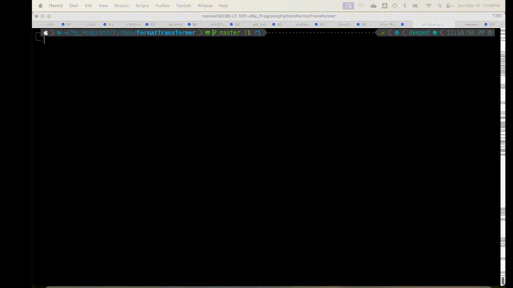

# FormatTransformer

**FormatTransformer** is a tool which move molecular structures (trajectory) within the periodic box and convert XYZ trajectories to VASP (POSCAR) or Quantum Espresso (QE) Input files.

## Installation

Clone repository and install package:

```bash
git clone git@github.com:rahulumrao/FormatTransformer.git
cd FormatTransformer
pip install .
```
## Usage

`xyzcenter` - center molecular structure at the center of box

```bash
❯ xyzcenter -h

usage: xyzcenter [-h] [-i INPUT] [-o OUTPUT] [-b BOX_SIZE]

Center molecular structure within PBC

options:
  -h, --help            Show this help message and exit
  -i INPUT, --input INPUT
                        Input XYZ trajectory file
  -o OUTPUT, --output OUTPUT
                        Output XYZ trajectory file
  -b BOX_SIZE, --box_size BOX_SIZE
                        Box size in Å (default: 15.0)

```

`xyzconverter` - Convert XYZ to VASP (POSCAR) or Quantum Espresso input files


```bash
❯ xyzconverter -h

usage: xyzconverter [-h] [-i INPUT] [-b BOX_SIZE [BOX_SIZE ...]] -o {VASP,QE} [-pp PSEUDO]

Convert XYZ to VASP POSCAR or Quantum Espresso input files

options:
  -h, --help            Show this help message and exit
  -i INPUT, --input INPUT
                        Input XYZ file containing multiple frames
  -b BOX_SIZE [BOX_SIZE ...], --box_size BOX_SIZE [BOX_SIZE ...]
                        Box size in Å (default: Cubic box of 12.0)
  -o {VASP,QE}, --output_type {VASP,QE}
                        Specify the output format: VASP or QE
  -pp PSEUDO, --pseudo PSEUDO
                        PseudoPotentials directory (required for Quantum Espresso)
```
## Examples

`❯ xyzcenter -i trajec.xyz -o centered_trajec.xyz -b 12.0`
```
==============================
Reading... trajec.xyz
==============================
Centered structure saved in centered_trajec.xyz wihtin periodic box 12.0
```

`❯ xyzconverter -i centered_trajec.xyz -o VASP -b 12.0`

```bash
Converting to VASP POSCAR format...
=============================================================
 Reading file : centered_trajec.xyz
 Box dimensions : A = 12.0, B = 12.0, C = 12.0
=============================================================
100%|███████████████████████████████████████████████████████████████████████| 99/99 [00:00<00:00, 4407.79it/s]
POSCAR files written in directory, poscar_files.
```

`❯ xyzconverter -i centered_trajec.xyz -o VASP -b 12 13 11`

```bash
Converting to VASP POSCAR format...
=============================================================
 Reading file : centered_trajec.xyz
 Box dimensions : A = 12.0, B = 13.0, C = 11.0
=============================================================
100%|███████████████████████████████████████████████████████████████████████| 99/99 [00:00<00:00, 5886.62it/s]
POSCAR files written in directory, poscar_files.
```


## AUTHOR
RAHUL VERMA \
Department of Chemical and Biomolecular Engineering \
NC State University, USA \
Email: rverma7@ncsu.edu